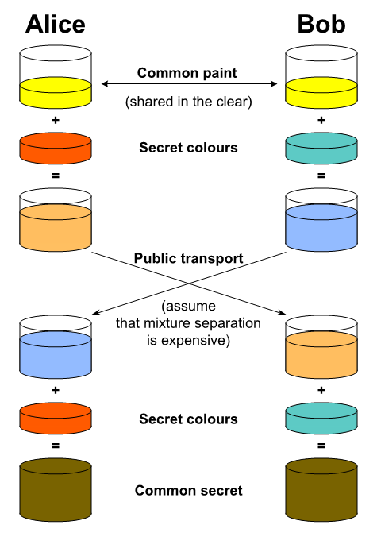
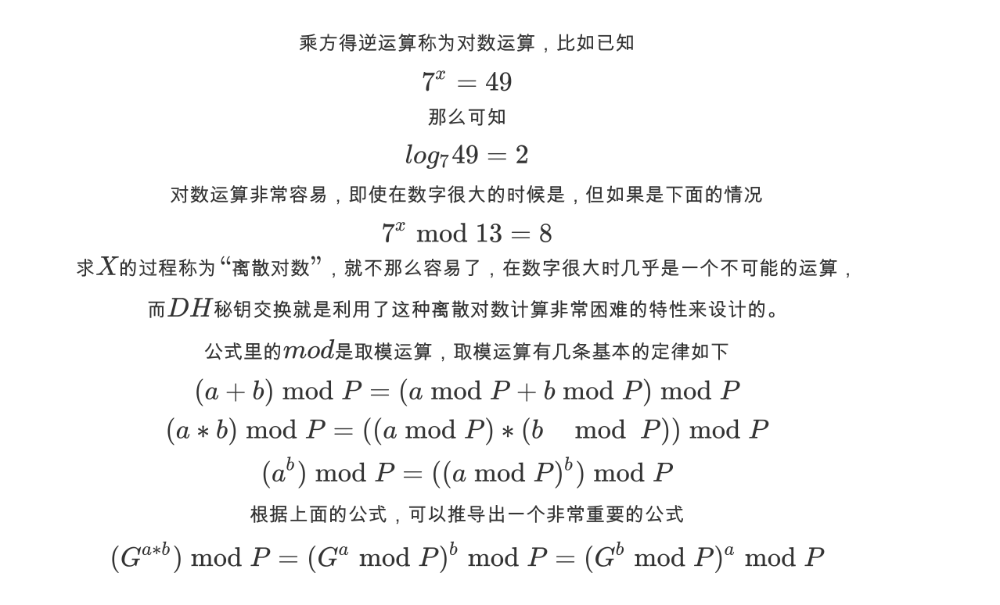

# Diffie–Hellman key exchange

> DH密钥交换:是一种安全协议。它可以让双方在完全没有对方任何预先信息的条件下通过不安全信道创建起一个密钥。这个密钥可以在后续的通讯中作为对称密钥来加密通讯内容。公钥交换的概念最早由瑞夫·墨克（Ralph C. Merkle）提出，而这个密钥交换方法，由惠特菲尔德·迪菲（Bailey Whitfield Diffie）和马丁·赫尔曼（Martin Edward Hellman）在1976年首次发表。
> 

## 概述
Diffie-Hellman密钥交换在双方之间建立一个共享密钥，可用于秘密通信，在公共网络上交换数据。[维基百科](!https://en.wikipedia.org/wiki/Diffie%E2%80%93Hellman_key_exchange)上通过使用颜色而不是非常大的数字来形象地说明密钥交换的一般概念。

简要说明：

- Alice和Bob首先约定好一个公开的颜色（但每次都应该不同）例如黄色。
- 他们各自挑选出一种私密的颜色，为橙色和蓝色
- Alice和Bob各自将两种颜色混合起来并交换

	这是这个过程中最关键的部分，Alice将私密的橙色和共享的黄色混合起来，产生橙棕色混合物，而Bob将他私密的蓝色和黄色混合起来生成淡蓝色混合物。混合以后公开交换两种颜色混合物
- 最后，Alice和Bob分别将从对方那里获得的颜色和自己的私密颜色混合在一起，最终双方都获得了同样的黄褐色混合物

这个颜色交换的秘密在于，颜色混合是一种“不可逆”的操作，当双方交换颜色时，尽管我们知道他们交换的颜色都是由一份黄色和另一份其他颜色混合得到的，但我们还是无法或者很难得到他们的私密颜色。

## 数学描述
> 而DH秘钥交换的原理非常相似，也是利用了数学上的一个“不可逆”的运算，就是离散对数（[Discrete logarithm](!http://en.wikipedia.org/wiki/Discrete_logarithm)）

- 公式推导

- 由上述公式，我们可以按如下流程来交换key

- 举个实际的例子
	- Alice与Bob协定使用 p=23以及base g=5.
	- Alice选择一个秘密整数a=6, 计算A = g^a mod p并发送给鲍伯。
		- A = 5^6 mod 23 = 8.
	- Bob选择一个秘密整数b=15, 计算B = g^b mod p并发送给爱丽丝。
		- B = 5^15 mod 23 = 19.
	- Alice计算s = B^a mod p
		- 19^6 mod 23 = 2.
	- Bob计算s = A^b mod p
		- 8^15 mod 23 = 2.

- Alice和Bob最终都得到了同样的值，因为在模p下 g^(ab)和 g^(ba) 相等。 注意a, b 和 (g^(ab) = g^(ba)) mod p 是私密的。 其他所有的值（p, g, g^a mod p, 以及 g^b mod p）都可以明文传递。 一旦Alice和Bob计算出了公共密钥，他们就可以把它用作对称密钥，以进行双方的加密通讯，因为这个密钥只有他们才能知道。 

- 当然，为了使这个例子变得安全，必须使用非常大的a, b 以及 p， 否则可以穷举所有的值，例如g^(ab) mod 23总共也只有（0～22）个值, 即使a和b很大也无济于事。但如果 p 是一个至少 300 位的质数，并且a和b至少有100位长， 那么即使使用全人类所有的计算资源和当今最好的算法也不可能从g, p和ga mod p 中计算出 a。这个问题就是著名的离散对数问题。注意g则不需要很大, 并且在一般的实践中通常是2或者5。可以参考（IETF RFC3526 文档），里面有几个常用的大素数可供使用。

## 安全性
- 在选择了合适的G和g时，这个协议被认为是窃听安全的。偷听者（"Eve"）可能必须通过求解迪菲－赫尔曼问题来得到g^(ab)。在当前，这被认为是一个困难问题。如果出现了一个高效的解决离散对数问题的算法，那么可以用它来简化a或者b的计算，那么也就可以用来解决迪菲－赫尔曼问题，使得包括本系统在内的很多公钥密码学系统变得不安全。

- G的阶应当是一个素数，或者它有一个足够大的素因子以防止使用Pohlig–Hellman算法来得到a或者b。由于这个原因，一个索菲热尔曼素数 q可以用来计算素数p=2q+1，这样的p称为安全素数，因为使用它之后G的阶只能被2和q整除。g有时被选择成G的q阶子群的生成元，而不是G本身的生成元，这样g^a的勒让德符号将不会显示出a的低位。

- 如果Alice和Bob使用的随机数生成器不能做到完全随机并且从某种程度上讲是可预测的，那么Eve的工作将简单的多。

- 私密的整数a和b在会话结束后会被丢弃。因此，迪菲－赫尔曼密钥交换本身能够天然地达到完备的前向安全性，因为私钥不会存在一个过长的时间而增加泄密的危险。

## 参考
- [Diffie–Hellman key exchange](https://en.wikipedia.org/wiki/Diffie%E2%80%93Hellman_key_exchange)
- [迪菲-赫尔曼密钥交换](https://zh.wikipedia.org/wiki/%E8%BF%AA%E8%8F%B2-%E8%B5%AB%E7%88%BE%E6%9B%BC%E5%AF%86%E9%91%B0%E4%BA%A4%E6%8F%9B)
- [一个简单的DH密钥协商算法的实现](https://thecodeway.com/blog/?p=964)
